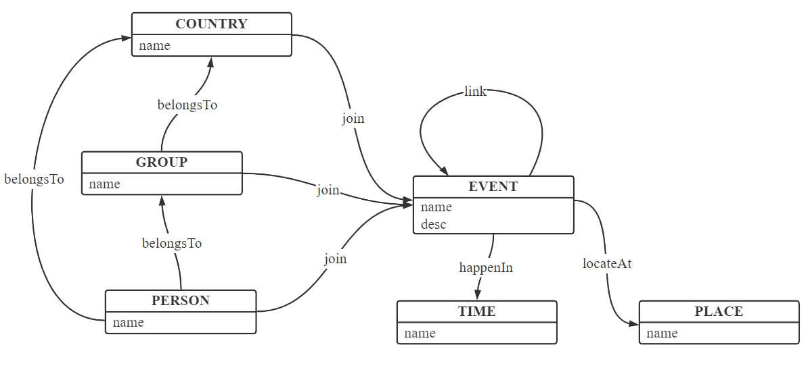

# Event-Mapping-Knowledge-Domain
- [Event-Mapping-Knowledge-Domain](#event-mapping-knowledge-domain)
  - [事件知识图谱](#事件知识图谱)
  - [数据集](#数据集)
  - [挂载地点](#挂载地点)
  - [构建流程](#构建流程)
  - [项目结构](#项目结构)

## 事件知识图谱

## schema

如下图所示：

## 数据集

wikipedia

## 挂载地点

## 构建流程

---

## 项目结构

|文件夹|作用|
|:---:|:---:|
|`config`|连接neo4j数据库的配置，请自行创建，若是本小组成员，请向相关同学索取|
|`data`|爬取数据；制定`schema`；导出json格式数据|
|`merge`|发生地点|
|`infer`|知识计算，服务端的入口文件|

data下的数据文件中`data.json`是NER完后的数据

`data_stepi.json`代表第`i`步结束后得到的数据

`clear.ipynb`是处理数据流程的笔记。

运行顺序:

1. 通过仓库中的爬虫和standford NER模型得到`data/data.json`
2. 运行`make_data.ipynb`得到 `data/data_step1.json` 和 `data/data_step2.json`
3. 运行`load_neo4j.py`将本地数据上传到neo4j服务器
4. 运行`make_vocab.py`从`neo4j`图数据库中抽取所有存在的节点和关系，并保存为`data/view.json`
5. 运行`make_map.ipynb`将数据总视图映射为节点和关系的 `name` 到 `index` 的双向映射，保存得到`map.full.json`

---

## 类型

### 节点类型
节点名称都是全大写

|名称|说明|
|:---:|:---:|
|`EVENT`|事件|
|`TIME`|时间|
|`PLACE`|发生地点|
|`COUNTRY`|国家|
|`GROUP`|群体（名族，宗教）|
|`PERSON`|个人|
